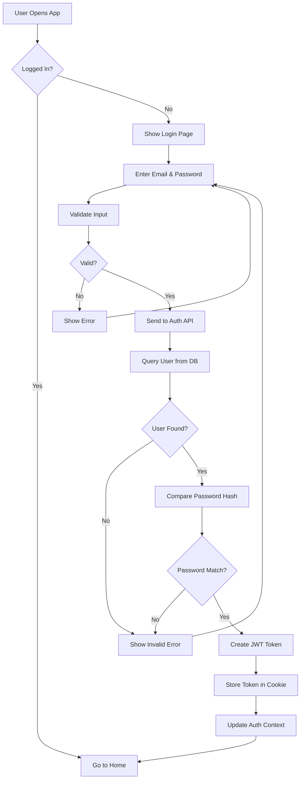
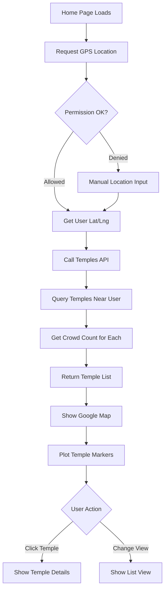
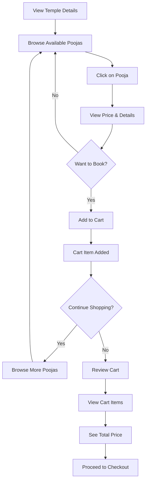
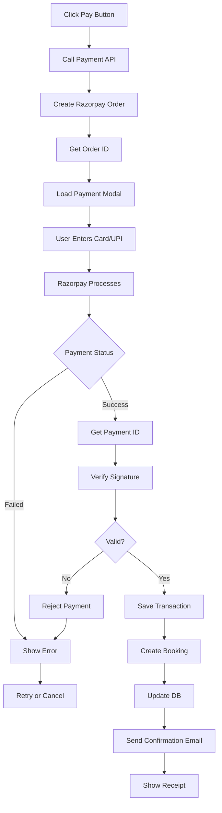
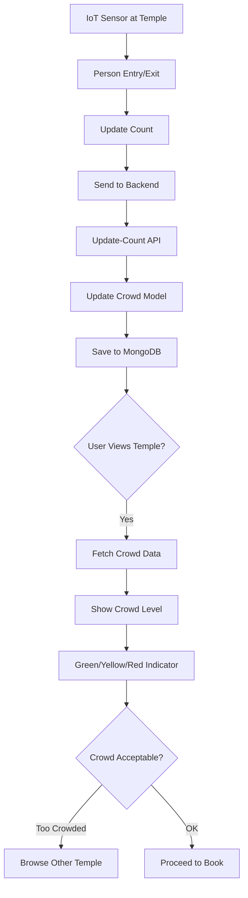
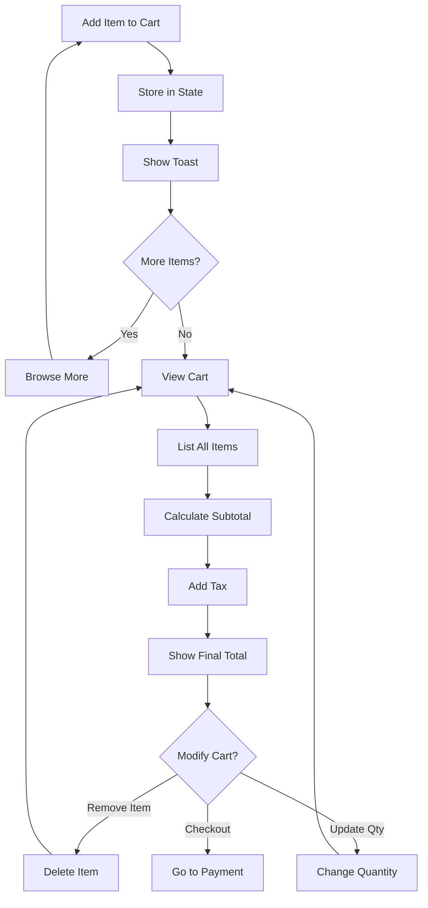
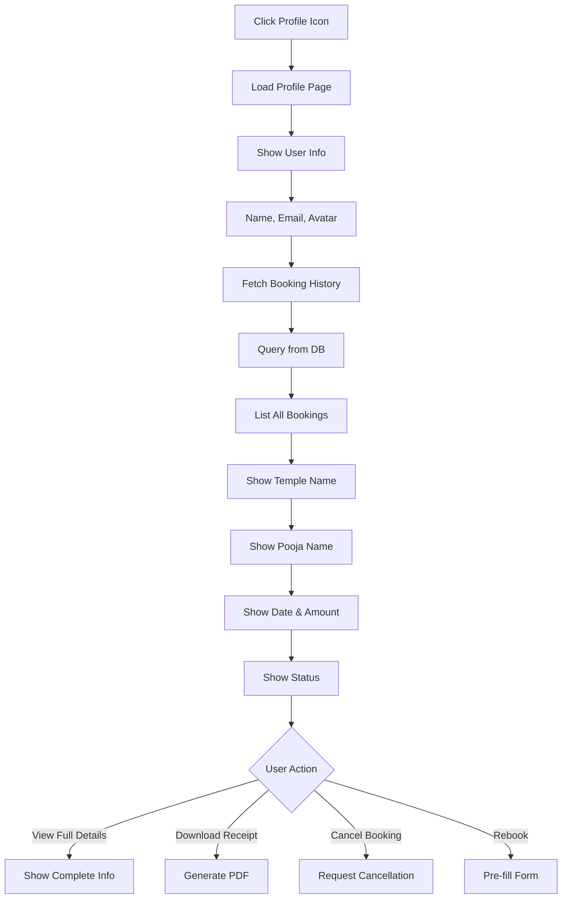

# TempleConnect - Core System Flowcharts

Simple, focused flowcharts for each major feature of the TempleConnect application.

---

## 1️⃣ Login & Authentication Flow



---

## 2️⃣ Temple Discovery & Map View



---

## 3️⃣ Pooja Booking Flow



---

## 4️⃣ Razorpay Payment Processing



---

## 5️⃣ Crowd Sensor Integration



---

## 6️⃣ Shopping Cart Management



---

## 7️⃣ User Profile & Booking History



---

## Quick Reference

| Flow | Purpose | Key Steps |
|------|---------|-----------|
| **Login** | Authenticate user | Email → Password → Hash → JWT → Store |
| **Temples** | Discover nearby temples | GPS → Query → Crowd Data → Map View |
| **Booking** | Book a pooja | Browse → Add Cart → Review → Checkout |
| **Payment** | Process payment | Order → Modal → Process → Verify → Receipt |
| **Crowd** | Real-time crowd tracking | IoT → Update → Display → User Decision |
| **Cart** | Manage items | Add → List → Calculate → Modify → Checkout |
| **Profile** | View booking history | Load → Fetch → Display → Actions |

---

**Total Flows**: 7 core flowcharts covering all major user journeys
**Focus**: Simple, clear, easy to understand and follow
**Updated**: April 2026
```
